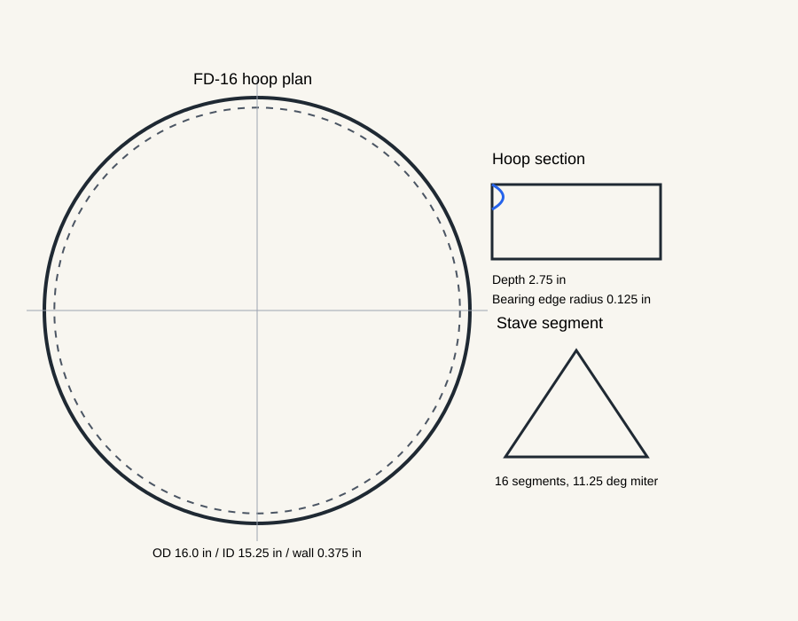

# Frame Drum Packet Overview

Frame drum engineering packet for a public-safe FD-14/FD-16/FD-18 first family.

# Project Intent

Create a repeatable baseline for frame-drum hoop construction, head mounting,
and validation while preserving tradition-specific context for later variants.

# Governing Model

Circular membranes follow Bessel-mode behavior. The packet uses the membrane
formula as a scaling guide and relies on prototype validation for final tuning.

# Family Spec

FD-14, FD-16, and FD-18 cover compact, baseline, and lower-voice studies.

# Manufacturing Paths

Steam-bent, stave-built, turned, and CNC-laminated paths are documented so the
first build can follow the most available shop method.

# Drawing Set

# CNC And Jig Handoff

The CNC plan is a pre-CAM setup for templates, forms, and optional laminated
hoop parts. It is not verified G-code.

# BOM And Sourcing

The BOM separates stable specs from live supplier facts. Prices are derived
estimates and must be checked before buying.

# Assembly

The assembly flow starts with hoop construction, then bearing edge preparation,
head mounting, settling, and validation.

# Risks

Primary risks are membrane prediction uncertainty, head humidity response,
steam-bend splitting, stave seam opening, and cultural attribution gaps.

# Validation

Roundness, wall thickness, bearing edge, fundamental, sustain, ergonomics, and
humidity response are measured after the first build.

# Public Readiness

The packet is public-safe as an engineering baseline. Tradition-specific claims
and photos should be expanded only after sources and owned images are added.

# Next Actions

Build FD-16, record the validation rows, replace placeholder photos, and decide
which tradition-specific branch gets the next packet.
